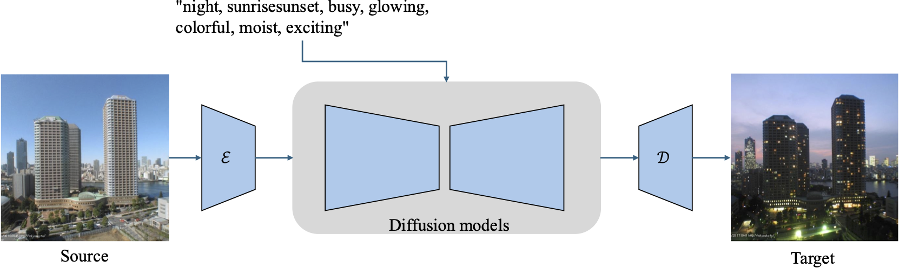

# Transient-Attribute-Transfer
This repository contains all the necessary information to reproduce the results discussed in Chapter 4 of my PhD Thesis. 

Zero-shot Transient Attribute Transfer is an exploratory research that was accepted at Women in Machine Learning Workshop (NeurIPS'24).

## Dataset and Finetuning
The dataset I utilised for all the experiments can be found [here](http://transattr.cs.brown.edu/). This dataset (TAT) contains 8571 images from 101 webcams, all annotated with 40 attribute labels [1].

To finetune both Stable Diffusion v1.5 and ControlNet, I first created a paired set using the annotations as the associated text prompts. You can find my custom dataset [here](https://huggingface.co/datasets/faziletgokbudak/instructpix2pix-image-attribute-transfer). I wrote the "tat_data_prep.py" script to prepare this set from the original dataset. The publi

For finetuning of the diffusion models with my custom dataset, I follow the instructions in the following links:

[ControlNet](https://github.com/lllyasviel/ControlNet/blob/main/docs/train.md) 

[Stable Diffusion v1.5](https://github.com/huggingface/diffusers/tree/main/examples/instruct_pix2pix)
## DDIM Inversion

The zero-shot experiments are based on DDIM inversion, where I played with the start step of the intermediate latents as well as the guidance scale of the text conditions. I ran my experiments based on this [Colab notebook](https://colab.research.google.com/github/huggingface/diffusion-models-class/blob/main/unit4/01_ddim_inversion.ipynb).

[1] Laffont, Pierre-Yves, et al. "Transient attributes for high-level understanding and editing of outdoor scenes." ACM Transactions on graphics (TOG) 33.4 (2014): 1-11.
